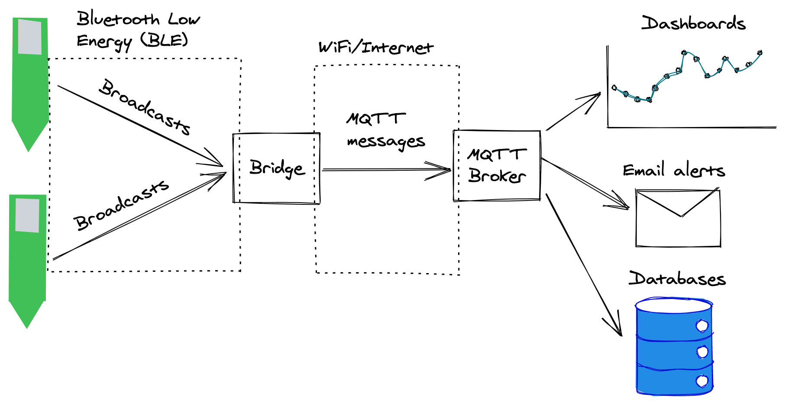
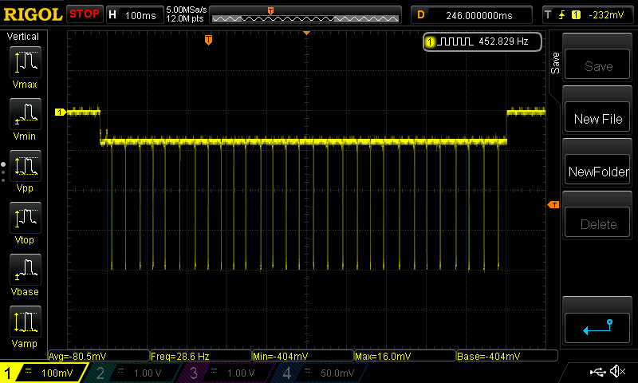

# b-parasite

  

b-parasite is an open source Bluetooth Low Energy (BLE) soil moisture and ambient temperature/humidity sensor.

# Features
* Soil moisture sensor. I wrote about how capacitive soil moisture sensors works on [this Twitter thread](https://twitter.com/rbaron_/status/1367182806368071685), based on [this great post](https://wemakethings.net/2012/09/26/capacitance_measurement/) on wemakethings.net
* Air temperature and humity sensor using a [Sensirion's SHTC3](https://www.sensirion.com/en/environmental-sensors/humidity-sensors/digital-humidity-sensor-shtc3-our-new-standard-for-consumer-electronics/)
* Powered by a common CR2032 coin cell, with a battery life of possibly over a year - see "Battery Life" below
* Open hardware and open source design

# Repository Organization
* [code/b-parasite/](./code/b-parasite/) - firmware code based on the [nRF5 SDK](https://infocenter.nordicsemi.com/index.jsp?topic=%2Fstruct_sdk%2Fstruct%2Fsdk_nrf5_latest.html&cp=7_1)
* [kicad/](./kicad/) - KiCad schematic, layout and fabrication files for the printed circuit board (PCB)
* [data/](data/) - data for testing and sensor calibration
* [bridge/](bridge/) - an [ESPHome](https://github.com/esphome/esphome)-based BLE-MQTT bridge

# How It Works

  

b-parasite works by periodically measuring the soil moisture, air temperature/humidity and broadcasting those values via Bluetooth Low Energy (BLE) advertisement packets. After doing so, the board goes into a sleep mode until it's time for another measurement. The sleep interval is configurable - I often use 10 minutes between readings, which is a good compromise between fresh data and saving battery.

At this point, b-parasite's job is done. We have many possibilities of how to capture its BLE advertisement packet and what to do with the data. What works okay for me is having a BLE-MQTT bridge that listens for these BLE broadcasts, decodes them and ships the sensor values through MQTT messages. The MQTT broker is then responsible for relaying the sensor data to interested parties. This is the topology shown in the diagram above.

A popular choice for a BLE-MQTT bridge is the [ESPHome](https://github.com/esphome/esphome) project, which runs on our beloved [ESP32](https://www.espressif.com/en/products/socs/esp32) boards. I forked ESPHome into [rbaron/esphome](https://github.com/rbaron/esphome) and added support for the `b_parasite` platform. An example project using this fork is defined in this repo, under [bridge/](bridge/) (check out [README.md](bridge/README.md) there for more info).

# Battery Life
**tl;dr:** By taking readings 10 minutes apart, the battery should last for over a year.

The main parameters involved in estimating the battery life are:
* Current consumption (both in operation and during sleep)
* Duty cycle (how much time it spends in operation vs. sleeping)
* Battery capacity - this is roughly 230 mAh for CR2032 cells

In the following screenshot, I measured the voltage of a 10 Ohm series resistor during the on-cycle, for a 8dBm transmitting power (the voltage is negative, so it is upside down):

  

The short high peaks correspond to when the radio is active, sending broadcasting packets. The average current consumption during this active time is roughly 9mA. Let's round it to 10mA. During off time, I measure a current of less than 3uA.

With these parameters in hand, I put together [this spreadsheet](https://docs.google.com/spreadsheets/d/157JQiX20bGkTrlbvWbWRrs_WViL3MgVZffSCWRR7uAI/edit#gid=0) in which you can estimate the battery life. For example, for an active time of one second and sleep time of ten minutes, we see a runtime of 488.10 days.

  

# License
The hardware and associated design files are released under the [Creative Commons CC BY-SA 4.0 license](https://creativecommons.org/licenses/by-sa/4.0/).
The code is released under the [MIT license](https://opensource.org/licenses/MIT).