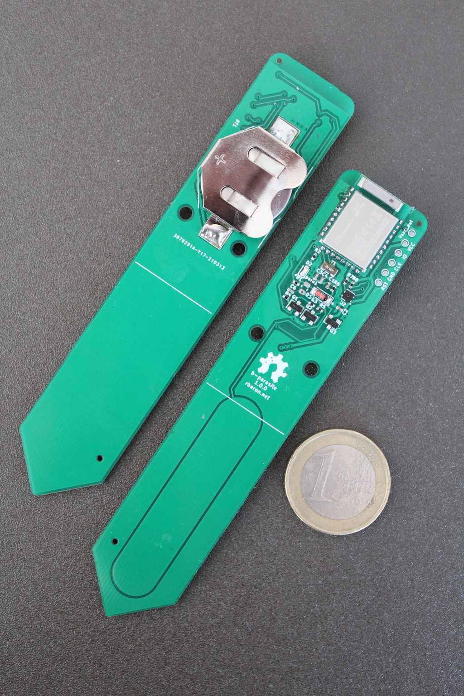
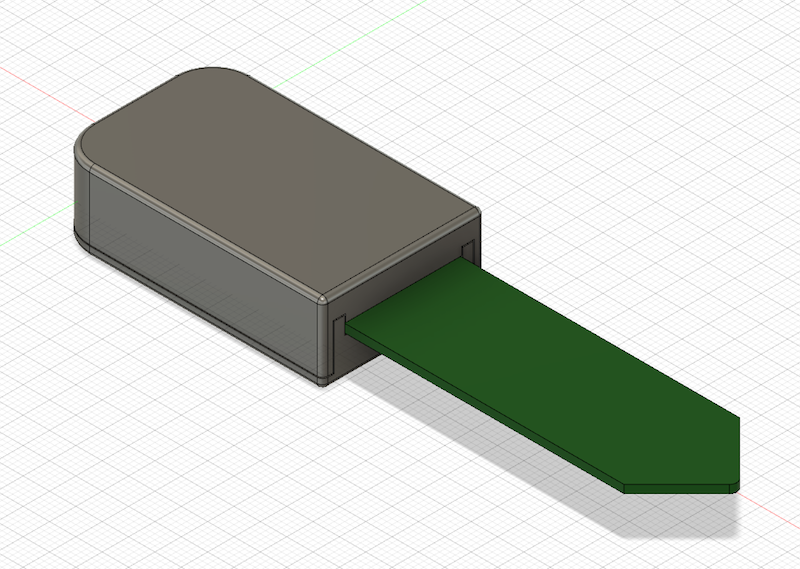

# b-parasite

  

b-parasite is an open source soil moisture and ambient temperature/humidity/light sensor.

# Features
* Capacitive Soil moisture sensor - see [this blog post](https://rbaron.net/blog/2021/04/05/How-capacitive-soil-moisture-sensors-work.html), [this Twitter thread](https://twitter.com/rbaron_/status/1367182806368071685), and [this post](https://wemakethings.net/2012/09/26/capacitance_measurement/) for nice resources on how they work
* Air temperature and humidity sensor using a [Sensirion's SHTC3](https://www.sensirion.com/en/environmental-sensors/humidity-sensors/digital-humidity-sensor-shtc3-our-new-standard-for-consumer-electronics/)
* Light sensor using an [ALS-PT19](https://everlighteurope.com/ambient-light-sensors/7/ALSPT19315CL177TR8.html) phototransistor
* Powered by a common CR2032 coin cell, potentially for over two years
* Support for [nRF52840](https://www.nordicsemi.com/products/nrf52840) and [nRF52833](https://www.nordicsemi.com/products/nrf52833) modules
* Open hardware and open source design

# Software
This repository also hosts a few different firmware samples for b-parasite.

|Sample|Description|Extra Documentation|
|---|---|---|
|[samples/ble](./code/nrf-connect/samples/ble)|This is the most battle-tested and useful firmware. It periodically reads all sensors and broadcast them via Bluetooth Low Energy (BLE). It works with [Home Assistant](https://www.home-assistant.io/) out of the box. |[Docs](./code/nrf-connect/samples/ble/README.md)|
|[samples/zigbee](./code/nrf-connect/samples/zigbee)| An experimental/educational/exploratory basic Zigbee sample built on [nRF Connect + ZBOSS](https://developer.nordicsemi.com/nRF_Connect_SDK/doc/latest/nrf/ug_zigbee.html). It integrates with [Home Assistant](https://www.home-assistant.io/) via [ZHA](https://www.home-assistant.io/integrations/zha) or [Zigbee2MQTT](https://www.zigbee2mqtt.io/). |[Docs](./code/nrf-connect/samples/zigbee/README.md)|
|[samples/blinky](./code/nrf-connect/samples/blinky)| The classic "Hello, world" |-|
|[samples/soil_read_loop](./code/nrf-connect/samples/soil_read_loop)| Read the soil moisture sensor on a loop. Useful for experimenting and calibrating the sensor. |-|

# Documentation
Information about how to order, assemble, build the samples, protect the sensor and flash the firmware is on [the Wiki](https://github.com/rbaron/b-parasite/wiki/How-to-Program).

# Repository Organization
* [code/nrf-connect/](./code/nrf-connect/) - Common library and samples, built with Nordic's [nRF Connect SDK](https://www.nordicsemi.com/Products/Development-software/nrf-connect-sdk).
* [kicad/](./kicad/) - KiCad schematic, layout and fabrication files for the printed circuit board (PCB)
* [data/](data/) - data for testing and sensor calibration
* [bridge/](bridge/) - an [ESPHome](https://github.com/esphome/esphome)-based BLE-MQTT bridge
* [case/](case/) - a 3D printable case

  

# Case
A 3D printable case model can be found in [case/](case/).

# License
The hardware and associated design files are released under the [Creative Commons CC BY-SA 4.0 license](https://creativecommons.org/licenses/by-sa/4.0/).
The code is released under the [MIT license](https://opensource.org/licenses/MIT).
