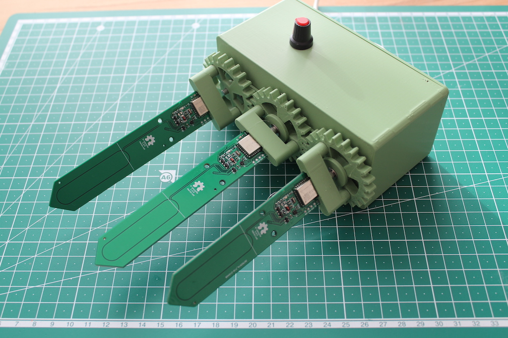

This is a silly attempt of making an automatic spinning jig. Don't take it too seriously - there are probably many easier, less dramatic ways to achieve the same results.

## Parts
| Part                      | Example                                                             |
|---------------------------|---------------------------------------------------------------------|
| DC motor - 12V, 60 rpm    | [Aliexpress](https://www.aliexpress.com/item/32987942205.html)      |
| PWM speed controller      | [Aliexpress](https://www.aliexpress.com/item/33005893596.html)      |
| 12V power supply          | [Aliexpress](https://www.aliexpress.com/item/32798499158.html)      |
| Power supply female jack  | [Aliexpress](https://www.aliexpress.com/item/1005004763316462.html) |
| M3 screws, washers & nuts | [Aliexpress](https://www.aliexpress.com/item/1005001975621423.html) |